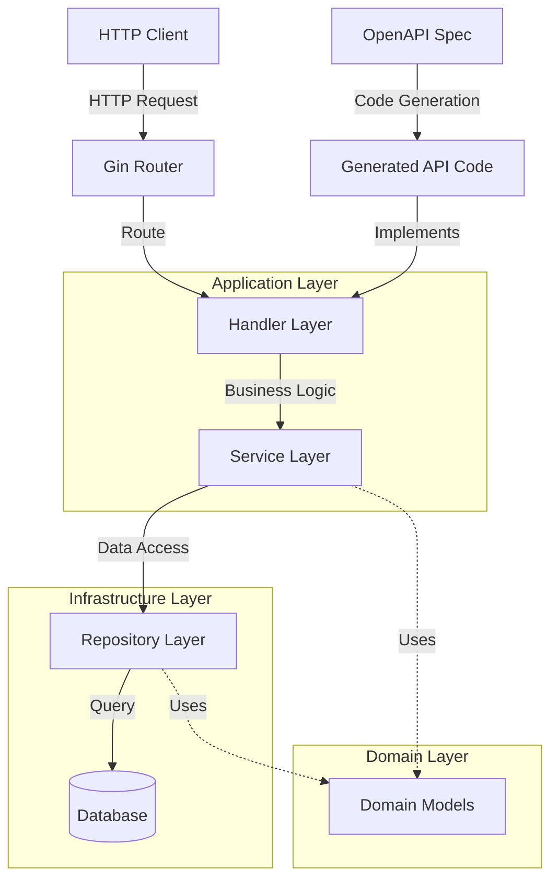
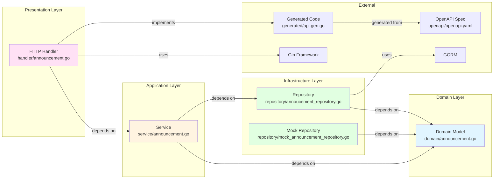
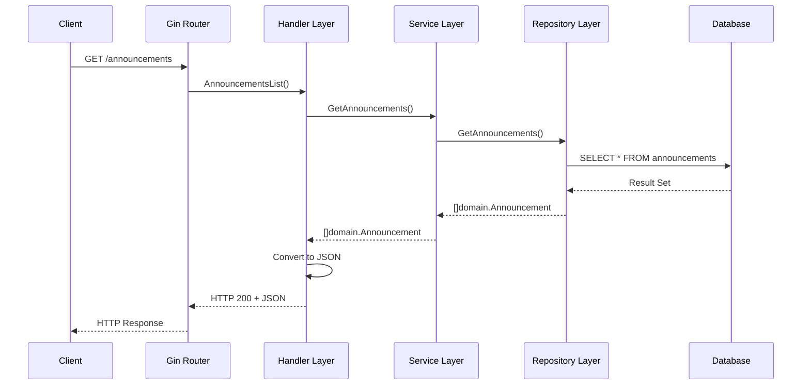
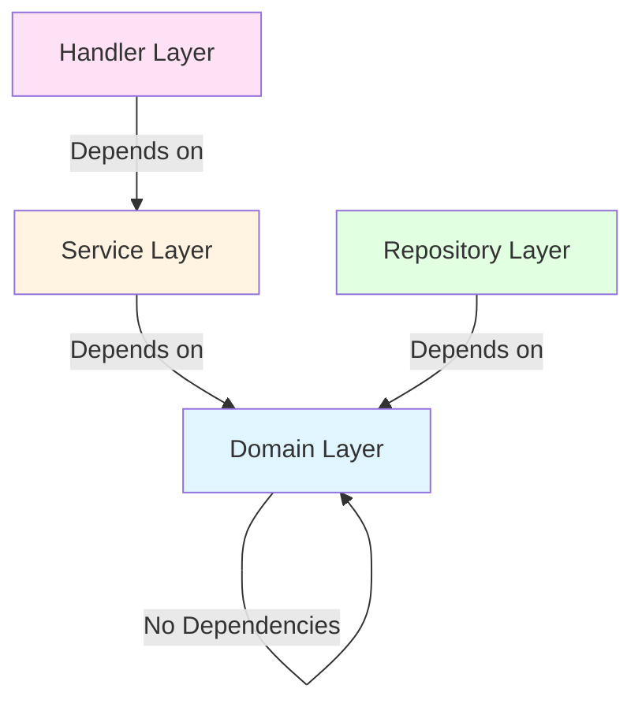

# アーキテクチャ

## システム全体像

## レイヤー構造と依存関係

## リクエストフロー

## コンポーネント詳細

### Handler Layer (`internal/handler/`)

- **責務**: HTTP リクエストの受信とレスポンスの返却
- **依存**: Service Layer
- **実装**: Gin フレームワークを使用
- **主要コンポーネント**: `Handler`構造体

### Service Layer (`internal/service/`)

- **責務**: ビジネスロジックの実装
- **依存**: Domain Layer, Repository Interface
- **主要コンポーネント**: `AnnouncementService`

### Domain Layer (`internal/domain/`)

- **責務**: ドメインモデルの定義
- **依存**: なし（最下層）
- **主要コンポーネント**: `Announcement`構造体

### Repository Layer (`internal/repository/`)

- **責務**: データアクセスの実装
- **依存**: Domain Layer
- **実装**: GORM を使用
- **主要コンポーネント**:
  - `announcementRepository` (実装)
  - `MockAnnouncementRepository` (テスト用)

## 依存関係の方向

**依存関係の原則**:

- 外側のレイヤーは内側のレイヤーに依存する
- 内側のレイヤーは外側のレイヤーに依存しない
- Domain Layer は最下層で、他のレイヤーに依存しない

## 技術スタック

- **Web Framework**: Gin
- **ORM**: GORM
- **API 仕様**: OpenAPI 3.1.0
- **コード生成**: oapi-codegen
- **言語**: Go
